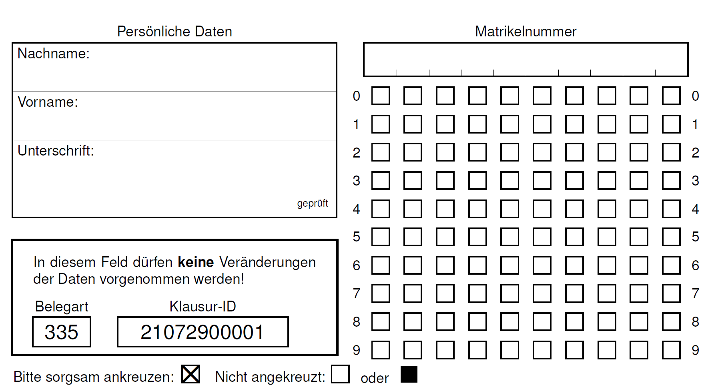
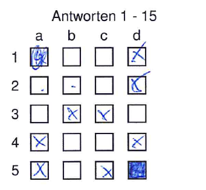
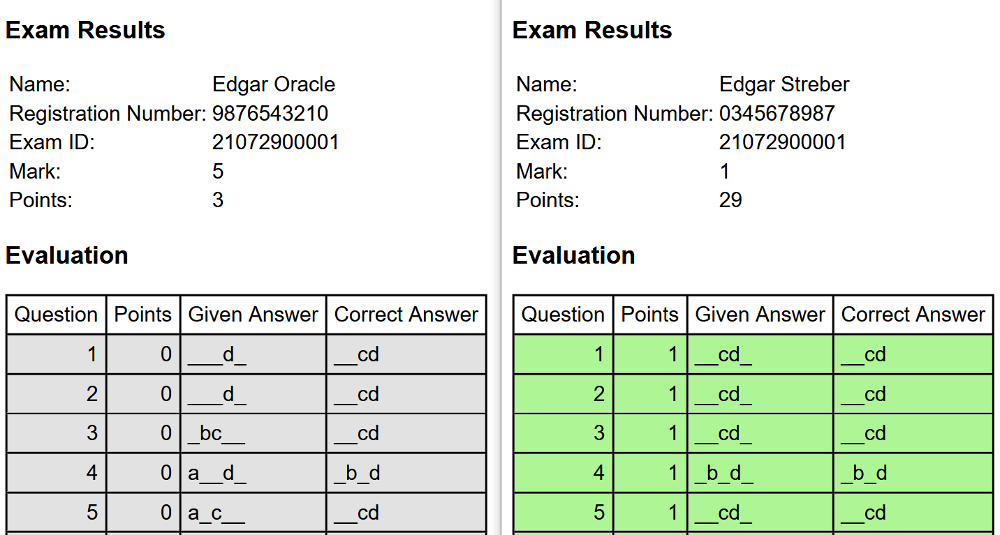

```{r setup, include=FALSE}
options(htmltools.dir.version = FALSE)

library(ggplot2)
library(tidyverse)
#library(HistData)
#library(titanic)
#library(broom)
library(tidyverse)
library(readr)
library(gridExtra)
library(cowplot)
#library(jtools)


#setwd("C:/Users/gu99mywo/Dropbox/Lehre/Bildung/Vorlesung Bildung EF/SoSe2021/Folien/05_Soziale_HK_F")

#Simulation Shoe size


```

```{css, echo=FALSE}
/* custom.css */
.left-code {
  color: #777;
  width: 38%;
  height: 92%;
  float: left;
}
.right-plot {
  width: 60%;
  float: right;
  padding-left: 1%;
}
.plot-callout {
  height: 225px;
  width: 450px;
  bottom: 5%;
  right: 5%;
  position: absolute;
  padding: 0px;
  z-index: 100;
}
.plot-callout img {
  width: 100%;
  border: 4px solid #23373B;
}

```


```{r best-features, echo=FALSE}
#search
xaringanExtra::use_search(show_icon = TRUE, position = "top-right")

xaringanExtra::style_search(match_background = "black",
                            input_background = "white",
                            input_border = "black",
                            match_current_background = "green")

xaringanExtra::use_tachyons()
xaringanExtra::use_tile_view()
xaringanExtra::use_webcam()

```


## 1. Die Klausur

<p style="font-size:120%;">“Fast alle Fragen der Klausur sind Multiple-Choice Aufgaben. Sofern bei den Fragen nichts vermerkt ist (kein Hinweis auf eine Single-Choice Frage), sind jeweils 2 von 4 Antworten richtig. Die richtigen Antworten sind durch Kreuze zu markieren.”</p> 

<p style="font-size:120%;">“Korrekt gesetzte Kreuze ergeben Pluspunkte, falsch gesetzte Kreuze Minuspunkte. Wichtig: die geringste Punktzahl pro Aufgabe beträgt 0 Punkte.”</p> 


<p style="font-size:120%;">“Die Bearbeitungszeit beträgt 60 Minuten. Die Klausur ist bestanden wenn man 60% der Punkte erreicht hat.”</p> 


---
## Das offizielle (!) Notenspektrum (auch an der FAU)

#### Note 1.0 - 1.3: 🤩 🤩 🤩
 - Excellent, eine sehr (noch) gute Leistung, besser geht es nicht!

#### Note 1.7 - 2.3: 😎
- Eine (noch) gute Leistung, aber mit ein wenig Luft nach oben!

#### Note 2.7 - 3.3: 🙃
- Befriedigend, weder eine gute aber auch keine schlechte Leistung

#### Note 3.7 - 4.0: 🤔
- Ausreichend, es war eine knappe Nummer, aber du hast bestanden!

#### Note 5.0: 💩 💩 💩
- Mangelhaft. Du hast weniger als 60% der Punkte erreicht und hättest auch raten können.


---
## The Questions

### Level 🐢 (1): Wissensabfrage
 - Keine Transferleistung
 - Frage kann allein mit Vorlesungsfolien gelöst werden

### Level 🐰 (2): Verständnisabfrage
 - Geringe Transferleistung
 - Inhalte der Vorlesung werden auf einen ähnlichen Sachverhalt übertragen

### Level 💀 (3): Anwendung und Transfer
 - Höchste Transferleistung
 - Vorlesungsfolien nutzen wenig bei der Beantwortung der Frage


---
## Der Scanbogen

<center></center>


---

## Ausfüllhinweise

<p style="font-size:120%;">“Auf dem Scanbogen ist vermerkt: Dieser Beleg wird maschinell gelesen. Bitte nicht falten, nicht knicken und nicht beschmutzen. Verwenden Sie zum Markieren einen blauen oder schwarzen Kugelschreiber. Nur deutlich erkennbare und positionsgenaue Markierungen werden ausgewertet”</p> 

<center>
</center>


---
## Reliabilität und Validität

<center>
</center>


---

## Level 1 Frage 1

### “Was trifft auf die EBF zu?”


<p style="font-size:120%;"> A.) Ein Ziel der EBF ist die Beschreibung von gesellschaftlichen Verhältnissen.</p> 

<p style="font-size:120%;">  B.) Prognosen sind in der Bildungsforschung aufgrund der Komplexität von Bildungsprozessen nicht umsetzbar. </p> 


<p style="font-size:120%;">  C.) Das Ziel der Bildungsforschung ist die Erklärung bildungssoziologischer Forschungsgegenstände. </p>

<p style="font-size:120%;">  D.) In der EBF können soziale Tatbestände (Kollektivmerkmale) werden nur durch andere soziale Tatbestände (Kollektivmerkmale) erklärt werden. </p> 


---

## Level 1 Frage 2

### Welche Aussagen treffen auf Geschlechtereffekte in der EBF zu?


<p style="font-size:120%;"> A.) In Deutschland haben sich Bildungsungleichheiten zugunsten von Frauen verschoben. Frauen haben im gesamten Bildungsverlauf die gleichen Chancen.</p> 

<p style="font-size:120%;"> B.) Aus heutiger Sicht hat das Geschlecht der Schülerinnen und Schüler keine Auswirkung mehr auf Bildungserfolg. </p> 


<p style="font-size:120%;"> C.) Bis weit in die Mitte des 20. Jahrhunderts waren insbesondere Arbeitermädchen vom Lande benachteiligt.</p>

<p style="font-size:120%;"> D.) Heute haben Mädchen weltweit teilweise immer noch ungleiche Bildungschancen wie Jungen. </p> 


---

## Level 1 Frage 3

### Welche Aussagen stimmen bezüglich Raymond Boundon?


<p style="font-size:120%;"> A.) Der primäre Effekt der Schichtzugehörigkeit erklärt Unterschiede im Entscheidungsprozess, die sich auf schulische Leistungen auswirken.</p> 

<p style="font-size:120%;"> B.) Die soziale Herkunft von Kindern beeinflusst deren Bildungsentscheidungen, auch unter Konstanthaltung schulischer Leistungen (sekundärer Effekt).</p> 


<p style="font-size:120%;"> C.) Sekundäre Effekte beziehen sich auf schichtspezifische Unterschiede im kulturellen Hintergrund die sich auf schulische Leistungen auswirken.</p>

<p style="font-size:120%;"> D.) Primäre Effekte beziehen sich auf schichtspezifische Unterschiede im kulturellen Hintergrund die sich auf schulische Leistungen auswirken. </p> 


---
class: middle, center

## Level 2

<p style="font-size:120%;"> Eine Studie untersucht, ob die soziale Herkunft eine Auswirkung auf das Erlangen des Abiturs hat. In der Studie lesen Sie, dass akademiker Kinder, im Vergleich zu nicht-akademiker Kinder, einen Odds Ratio (OR) von 1,7 haben. </p> 


---

## Level 2 Frage 1

### Welche Aussagen treffen bezüglich des Odds Ratio  zu?


<p style="font-size:110%;">Die Chance ein Abitur zu erlangen ist für akademiker Kinder im Vergleich zu nicht-akademiker Kinder um den Faktor 1,7 erhöht.</p> 

<p style="font-size:110%;"> B.) Die Chance ein Abitur zu erlangen ist für nicht-akademiker Kinder im Vergleich zu akademiker Kinder um den Faktor 1,7 erniedrigt.</p> 


<p style="font-size:110%;"> C.) Die Wahrscheinlichkeit ein Abitur zu erlangen ist für akademiker Kinder im Vergleich zu nicht-akademiker Kinder um den Faktor 1,7 erhöht.</p>

<p style="font-size:110%;"> D.) Die Wahrscheinlichkeit ein Abitur zu erlangen ist für nicht-akademiker Kinder im Vergleich zu akademiker Kinder um den Faktor 1,7 erniedrigt. </p> 


---

## Level 2 Frage 2

### Was versteht man unter dem “Fundamental Problem of Causal Inference” (Single-Choice)? 


---


### Das fundamentale Problem der kausalen Inferenz ...

<p style="font-size:110%;"> A.) bezieht sich auf die selektive Teilnahme an Umfragen, weshalb die Messung des kausalen Effekts verzerrt sein kann und ein Kausalschluss häufig nicht zulässig ist. </p> 


<p style="font-size:110%;"> A.) bezieht sich auf die selektive Teilnahme an Umfragen, weshalb die Messung des kausalen Effekts verzerrt sein kann und ein Kausalschluss häufig nicht zulässig ist. </p> 

<p style="font-size:110%;"> B.) verdeutlicht, dass nur individuelle kausale Effekte (Individual Average Treatment Effects) in einem Experiment ermittelt werden können.</p> 


<p style="font-size:110%;"> C.) verdeutlicht einen kontrafaktischen Zustand: Eine Person kann nicht gleichzeitig ein Treatment bekommen und in der Kontrollgruppe sein. </p>

<p style="font-size:110%;"> D.) zeigt, dass Experimente aufgrund ethischer Bedenken (Kinder einem Stimulus aussetzen) in der Bildungsforschung nicht einsetzbar sind. </p> 


---

## Level 3 Frage 1

### Faktorielle Survey Experimente (FSE) werden zunehmend in der EBF eingesetzt. Was trifft auf FSE zu (Single-Choice)?


<p style="font-size:110%;"> A.) In einem FSE werden Probanden zufällig <u>zu Vignetten</u> des FSE zugeordnet, weshalb Drittvariableneffekte ausgeschlossen werden können.</p> 

<p style="font-size:110%;"> B.) In einem FSE werden Probanden zufällig <u>zu einem Universum</u> des FSE zugeordnet, weshalb Drittvariableneffekte ausgeschlossen werden können. </p> 


<p style="font-size:110%;"> C.) In einem FSE werden Probanden zufällig <u>zu einer Dimension</u> des FSE zugeordnet, weshalb Drittvariableneffekte ausgeschlossen werden können.</p>

<p style="font-size:110%;"> D.) In einem FSE werden Probanden zufällig <u>zu einem Level</u> des FSE zugeordnet, weshalb Drittvariableneffekte ausgeschlossen werden können. </p> 


---
class: middle, center

### Remember

<p style="font-size:120%;">“Bitte denkt bei der Beantwortung der Fragen daran: Edgar ist kein (!) Schurke oder Bösewicht ;-) Es gibt keine versteckten Botschaften zwischen den Zeilen; es wird keine doppelte Verneinungen geben um Aufgaben bewusst schwieriger zu machen oder sonst irgendwelche Tricks.” </p> 

<p style="font-size:120%;">“Etwaige Ungereimtheiten lassen sich nach der Klausur klären und Fehler in der Klausur werden nicht zum Nachteil der Studierenden ausgelegt. So, it won't get that hard!”</p> 

<p style="font-size:120%;">“Plus: Im Live Call vor der Klausur habt Ihr nochmal die Gelegenheit mich mit Fragen zu löchern. See you soon 😇 !!”</p> 


