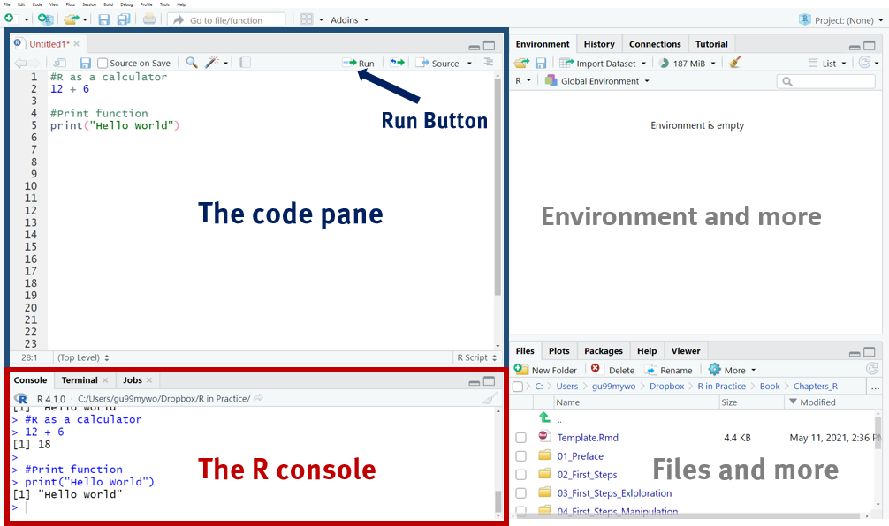

```{r setup, include=FALSE}
options(htmltools.dir.version = FALSE)

library(ggplot2)
library(tidyverse)
#library(HistData)
#library(titanic)
#library(broom)
library(tidyverse)
library(readr)
library(gridExtra)
library(cowplot)
#library(jtools)


knitr::opts_chunk$set(fig.retina = 3, warning = FALSE, message = FALSE)

#setwd("C:/Users/gu99mywo/Dropbox/Lehre/Bildung/Vorlesung Bildung EF/SoSe2021/Folien/05_Soziale_HK_F")

theme_set(theme_minimal(base_size = 20)) # sets a default ggplot theme


```


```{r best-features, echo=FALSE}
#search
xaringanExtra::use_search(show_icon = TRUE, position = "top-right")

xaringanExtra::style_search(match_background = "black",
                            input_background = "white",
                            input_border = "black",
                            match_current_background = "green")

xaringanExtra::use_tachyons()
xaringanExtra::use_tile_view()
xaringanExtra::use_webcam()

colors = c(
  red = "#f34213",
  purple = "#3e2f5b",
  orange = "#ff8811",
  green = "#136f63",
  blue = "#002B36",
  white = "#FFFFFF"
)
```


## Agenda

### 1. Installation R und RStudio
### 2. Base R
### 3. Data types and structures


---

class: bottom, center, inverse

# 🤖 .red[(1) Installation] 


---
## Install R

.left-column[
</br>
</br>
<https://www.r-project.org/>
] 

.right-column[

]


---
## Use R as a calculator

```{r}
#basic operations: +,-,*,/ 
5 * 188 
# square root
sqrt(16)
# logarithm (base: Euler's number e)
log(1)
#print some words
print("Hello World")

```


---
## Install RStudio

.left-column[
</br>
<https://www.rstudio.com/>
] 

.right-column[

]


---
## RStudio panes

➡️️ Open a new R script :  `File > New File > R Script`

<center></center>

```{r}
# Press Ctlr + Enter on windows or Cmd + Enter on a mac to run code
```


---
## Use RStudio as a calculator

```{r}
#basic operations: +,-,*,/ 
5 * 188 
# powers
3^2              

#print some words
print("Hello World")

```

### Which differnces between R and RStudio did you realize?


---
## Auto-Completion

<center></center>

```{r, error=TRUE}
#Do not forget surrounding quotes to print the string!
print(Hello)
```


---
## The files pane 🗄️

.pull-left[
### - Shows your working directory
### - Helps you to create folders, rename and delete files
### - More?
### What is your working directory?
```{r}
#getwd gets/prints your working directory
getwd()
```

]
.pull-right[
<center></center>
]


---
## The plots pane

.pull-left[
### An example plot
```{r, fig.height=4}
#Copy and run the following code!
barplot(c(a = 22, b = 28, 
          c = 33, d = 40, 
          e = 55)
        )
```

]

.pull-right[
### In RStudio
<center></center>
]

---
## R Packages

.pull-left[
### Packages increase R capacities
### Some example packages:
- `ggplot2`: Graphs
- `dplyr`: Data manipulations
- `palmerpenguins`: Penguins data
- `shiny`: Interactive dashboards
- ...
### Packages need (1) to be installed and (2) to be loaded

]

.pull-right[
### Code
```{r, eval=FALSE}
#1: install package (only once)
install.packages("palmerpenguins")

#>Try URL 'https://cran.rstudio.com/bin/4.0/palmerpenguins_0.1.0.tgz'
#>Content type 'application/x-gzip' length 3001738 bytes (2.9 MB)
#>==================================================
#>downloaded 2.9 MB

#>The downloaded binary packages are in
#>	/var/folders/0v/T//Rtmp4z29rO/downloaded_packages
```

```{r}
#2: load package (each new R session)
library(palmerpenguins)
```

]


---
## PracticeR Package

.left-column[

] 

.right-column[
### Practice R has several online tutorials
```{r, eval=FALSE}
install.packages("devtools")
devtools::install_github("edgar-treischl/PracticeR")
```
]


---
## The tutorial pane

<center></center>


---
## The help pane

### R comes with many helpful ressources

.pull-left[
```{r, eval=FALSE}
#Ask for help
?barplot
#Search for keywords/texts strings within the help files
help.search("keywords")
```

]

.pull-right[
<center></center>
]


---
## Further panes

### - The environment pane
- Shows the working environment (e.g. imported data, objects)

### - The history pane
- Shows previous applied code
- Helpful if you make any mistakes

### - Connections
- Helps you manage to connect to databases (and other instances)


---
background-image: url("images/g1.gif")
background-size: cover
class: bottom, center

# .white[(2) Base R] 


---
## The assignment operator

```{r}
#The assignment operator assigns a to 5
a <- 5
a
```

```{r}
#R does not print the results of the assignment
(a <- "Hello!")
```

```{r, echo=TRUE}
#ABC of the assignment operator
a <- 5
b <- 6
c <- a + b
c
```

---
class: middle, center, inverse

### Do it like a pro, press: 
### `<Alt> + <->`
#### The assignment operator will appear out of nothing.


---
## Objects 🤖

```{r}
## Everything can be an object
a
```


```{r}
# Compare objects and R returns a boolean object (TRUE/FALSE)
a > b
a >= b
a == b
a != b
```


---
### Objects

```{r, eval=FALSE}
#Data
myData <- read_excel(myData.xlsx)
```

```{r, eval=FALSE}
#Graphs: For example, two combine several graphs
g1 <- barplot(c(a = 22, b = 28, c = 33, d = 40, e = 55))
```

```{r}
#Calculation
mean_value <- mean(c(22, 28, 33, 40, 55))
mean_value
```


---
## Functions

### A simple example
```{r, echo=TRUE}
#You are doing the boring stuff
running_number <- c(1, 2, 3, 4, 5, 6, 7, 8, 9, 10)
running_number
```

```{r}
#Let base R do the boring stuff
running_number <- c(1:10)
running_number
```

```{r}
#Let functions do the boring stuff! 
seq(1:10)
```

---
## Functions::Let functions do the boring stuff! 🧙

The `sequence()` function:
```{r, echo=TRUE}
seq(1,10,  by=2)
```

The `repetition()` function:

```{r}
rep("I am working like a machine!", times = 3)
```

```{r}
rep(c(1, 2), each = 2)
```

# 🤖

---
### Functions

### An illustration

```{r, eval=FALSE, echo=TRUE}
#how a function look like:
function(x){
  do something with X
  }
```

### Un unrealistic example
```{r, eval=TRUE, echo=TRUE}
#input
x <- c(1, 2, 3)

my_fun <- function(x){
  print(x)
}

my_fun(x)
```


---
### An second illustration: Mean function
### Sum/Length

```{r , echo=TRUE}
#The sum function:
sum(c(3,2,1))
#The length function:
length(c(3,2,1))

```


---
### Functions: Mean()

```{r, eval=TRUE, echo=TRUE}
mean_function <- function(data){
  mean <- sum(data)/length(data) #save and create mean
  return(mean)
}

data <- c(3, 2, 1, 5, 8, 12, 1)
mean_function(data)
```

### The real 🤙 mean()

```{r, echo=TRUE}
round(mean(c(3, 2, 1, 5, 8, 12, 1)), 
      digits = 2)
```


---
background-image: url("images/g3.gif")
background-size: cover
class: bottom, center

# .white[(3) Data types and structure] 


---
## Data types

### - Factors (*fctr* for categorical variables: sex("male", "female"))
### - Integers (*int*: 5, 9)
### - Real numbers (*doubles* or *dbl*: 3.32)
### - Dates and times (*dates* or *dttm*: ).
### - Strings and character vectors (*chr*: "Hello World")
### - Logical (*lgl*: TRUE, FALSE)


---
## Data types

### The class() function tells you the type of the object:
```{r}
x <- c(1.3, 2.5, 3.0)
class(x)
```

### The typeof() function returns the storage mode of an object:

```{r}
typeof(x)
```


---
## Data types

### Vector
```{r}
x<- c(1, 2, 3, 4)
x
```

### Data frame

```{r}
x<- c(1, 2, 3, 4)
y<- c("a", "a", "a", "a")

df <- data.frame(x, y)
df
```

---
## Data types

### Tibble

```{r, eval=FALSE}
tibble(x = c(1, 2, 3, 4), 
       y = c("a", "a", "a", "a"))

```

### Tribble (Transposed Tibble)

```{r, echo=TRUE, message=FALSE, warning=FALSE}
tribble(
  ~sex, ~y, ~birth,
  "Men", 16.2, "1976-10-09",
  "Women", 22.7, "1981-01-06"
)
```

---
background-image: url("images/g2.gif")
background-size: cover
class: bottom, center

### .white[Tibble ️vs. Data Frames] 

---
### Tibble ⚔️ data frames I: Output

```{r}
as_tibble(mtcars)
```


---
### Tibble ⚔️ data frames I: Output

```{r}
mtcars
```


---
### Tibble ⚔️ data frames II: Recycling vectors

```{r, eval=FALSE}
#what you wanted to do:
data.frame(person = 1:6, sex = c(1, 2, 1, 1, 2, 2)
```

```{r}
#what you did by accident:
data.frame(person = 1:6, sex = 1:2)
```

#### ⚡Recycling vectors may lead to serious errors!

```{r, warning=TRUE, error=TRUE}
tibble(person = 1:6, sex = 1:2)
```


---
## Data types

### Lists 🛍

```{r}
#lists combine heterogeneous output in one object

my_list <- list("numbers" = 1:10, 
              "letters" = LETTERS[1:3], 
              "names" = c("John", "Paul", "George", "Ringo") )
my_list
```


---
## Data types: Slicing

```{r, echo=FALSE}
df <- data.frame(names = c("Bruno", "Justin", "Miley", "Ariana"),
                 x = seq(1:4), 
                 sex = rep(c("male", "female"), each = 2))
df
```

### Slicing a vector

```{r}
x <- df$names
x
```

---
### Slicing a vector

```{r}
#The third element
x[3]
#The same works with $
df$names[3]
#All elements except the third element
x[-3]
#From the second to the third element
x[2:3]
```


---
### Slicing data frame

```{r}
#the first row
df[1, ]
#the first row and the first column
df[1, 1]
#the first column
df[ , 1]

```

---
### Slicing data frame

### The same principals work as we have seen ...

```{r}
#Start and endpoint
df[1:2, ]
#All elements except
df[-1, ]
```


---
### Slicing a list

### Life is getting a bit more complicated

```{r}
#my_list[1] returns the list, the first element of the list and not the vector!
my_list[1]
```

```{r}
# returns the values of the first list
my_list[[1]]
```

---
### Slicing a list: Extracting single elements

```{r}
#First three element of the first list
my_list[[1]][1:3]
```

```{r}
#You must take the nested structure of a list into account
my_list[1][1:3]
```

➡️ The first list has only one element, the second and the third element of the first list does not exist

---
## Code first

.pull-left[
```{r plot-last, fig.show = 'hide'}
dat <- data.frame(
  time = factor(c("Lunch","Dinner"), levels=c("Lunch","Dinner")),
  total_bill = c(14.89, 17.23)
)

library(ggplot2)

# Very basic bar graph
ggplot(data=dat, aes(x=time, y=total_bill)) +
    geom_bar(stat="identity")
```
]
.pull-right[
```{r ref.label = 'plot-last', echo = FALSE}
```
]


---
## Palmer Penguins

<center></center>


---

## Plot first

.pull-left[
```{r plot-first, echo = FALSE}
# Very basic bar graph
ggplot(data=dat, aes(x=time, 
                     y=total_bill)) +
    geom_bar(stat="identity") #<<
```
]
.pull-right[
```{r ref.label = 'plot-first', eval = FALSE}
```
]


